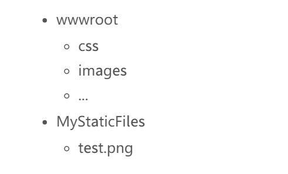

# 静态文件

**静态文件（static files）**，诸如 `HTML`、`CSS`、`图片`和 `JavaScript` 之类的资源会被 ASP.NET Core 应用直接提供给客户端。

## 静态文件服务
- 位于 `web root`（`<content-root>/wwwroot`）文件夹下
- `Content root`
   - 一般把项目的**当前目录**设置为 `Content root`


   ```c#

    .UseContentRoot(Directory.GetCurrentDirectory()) //把项目的当前目录设置为 Content root
   ```

- **静态文件**能够被保存在网站`根目录`下的任意文件夹内，并通过**相对根的路径**来访问

### 静态文件中间件的配置
想要启用静态文件服务，你必须配置`中间件`（`middleware`），**把静态文件中间件加入到管道内**
1. 在项目中增加 `Microsoft.AspNetCore.StaticFiles` 包依赖
2. 从 `Startup.Configure` 调用 `UseStaticFiles` **扩展方法**

```csharp
public void Configure(IApplicationBuilder app, IHostingEnvironment env, ILoggerFactory loggerFactory)
{
    app.UseStaticFiles(); //手工高亮
}
```
- `app.UseStaticFiles();` 使得 `web root`（默认为 `wwwroot`）下的文件可以被访问

### 如何通过使用 `UseStaticFiles` 将其他目录下的内容也向外提供服务?
存在目录结构  


```csharp
public void Configure(IApplicationBuilder app, IHostingEnvironment env, ILoggerFactory loggerFactory)
{
    app.UseStaticFiles();

    app.UseStaticFiles(new StaticFileOptions()                                      //手工高亮
    {                                                                               //手工高亮
        FileProvider = new PhysicalFileProvider(                                    //手工高亮
            Path.Combine(Directory.GetCurrentDirectory(), @"MyStaticFiles")),       //手工高亮
        RequestPath = new PathString("/StaticFiles")                                //手工高亮
    });                                                                             //手工高亮

```
- 在请求 `http://<app>/StaticFiles/test.png` 时，就能访问到 `test.png` 文件

## 静态文件授权
- 静态文件模块并**不**提供授权检查
- 任何通过该模块提供访问的文件，包括位于`wwwroot`下的文件都是公开的
- 如何提供授权?
  - 将文件保存在 `wwwroot` 之外并将目录设置为可被静态文件中间件访问到，同时——
  - 通过一个控制器的 `Action` 来访问它们，通过授权后返回 `FileResult`

## 允许直接浏览目录
1. 在 `Startup.Configure` 中调用 `UseDirectoryBrowser` 扩展方法可以开启网络应用目录浏览
```csharp
 app.UseDirectoryBrowser(new DirectoryBrowserOptions()
    {
        FileProvider = new PhysicalFileProvider(
            Path.Combine(Directory.GetCurrentDirectory(), @"wwwroot\images")),
        RequestPath = new PathString("/MyImages")
    });
```
2. 并且通过从 `Startup.ConfigureServices` 调用 `AddDirectoryBrowser` 扩展方法来增加所需服务
```csharp
public void ConfigureServices(IServiceCollection services)
{
    services.AddDirectoryBrowser();
}
```

## 默认文档服务
设置**默认首页**能给你的站点的每个访问者提供一个**起始页**
- 须在 `Startup.Configure` 中调用 `UseDefaultFiles` 扩展方法

```csharp
public void Configure(IApplicationBuilder app)
{
    app.UseDefaultFiles();                                                          //手工高亮
    app.UseStaticFiles();
}
```
- 通过 `UseDefaultFiles`，请求文件夹的时候将检索以下文件
  - default.htm
  - default.html
  - index.htm
  - index.html

  - 如何将默认文件名改为 `mydefault.html`?

```csharp
public void Configure(IApplicationBuilder app)
{
    // Serve my app-specific default file, if present. 
    DefaultFilesOptions options = new DefaultFilesOptions(); 
    options.DefaultFileNames.Clear(); 
    options.DefaultFileNames.Add("mydefault.html");
    app.UseDefaultFiles(options);
    app.UseStaticFiles();
}
```

## UseFileServer

```csharp

//下面的代码启用了静态文件和默认文件，但不允许直接访问目录：
app.UseFileServer();

//下面的代码启用了静态文件、默认文件和目录浏览功能：
app.UseFileServer(enableDirectoryBrowsing: true);
```

###  FileServerOptions 
如果希望提供 `web root`之外存在的文件的访问，你要实例化并配置一个`FileServerOptions` 对象传递给 `UseFileServer` 的参数

```csharp
public void Configure(IApplicationBuilder app, IHostingEnvironment env, ILoggerFactory loggerFactory)
{
    app.UseStaticFiles();

    app.UseFileServer(new FileServerOptions()                                       //手工高亮
    {                                                                               //手工高亮
        FileProvider = new PhysicalFileProvider(                                    //手工高亮
            Path.Combine(Directory.GetCurrentDirectory(), @"MyStaticFiles")),       //手工高亮
        RequestPath = new PathString("/StaticFiles"),                               //手工高亮
        EnableDirectoryBrowsing = true                                              //手工高亮
    });                                                                             //手工高亮
}
```
### FileExtensionContentTypeProvider
- `FileExtensionContentTypeProvider` 类内包含一个将文件扩展名映射到 `MIME` 内容类型的集合

## 非标准的内容类型
- 如何未知内容类型的文件请求将返回一张图片？
```csharp
public void Configure(IApplicationBuilder app, IHostingEnvironment env, ILoggerFactory loggerFactory)
{
    app.UseStaticFiles(new StaticFileOptions
    {
        ServeUnknownFileTypes = true,
        DefaultContentType = "image/png"
    });
}
```
> **警告**
> - 开启 `ServeUnknownFileTypes` 存在安全风险，请打消这个念头
> - UseDirectoryBrowser 和 UseStaticFiles 可能会泄密。我们推荐你 **不要** 在生产环境开启目录浏览。
> - 要小心哪些被你开启了 `UseStaticFiles`或 `UseDirectoryBrowser` 的目录（使得其子目录都可被访问）。我们建议将公开内容放在诸如 `<content root>/wwwroot` 这样的目录中，远离应用程序视图、配置文件等

- 代码文件（包括 `C#`和 `Razor`）应该放在应用程序项目的 `web root` （默认为 `wwwroot`）之外的地方。这将确保您创建的应用程序能明确隔离客户端侧和服务器侧源代码，此举能防止服务器侧的代码被泄露