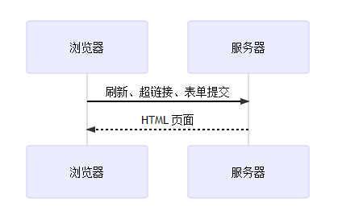
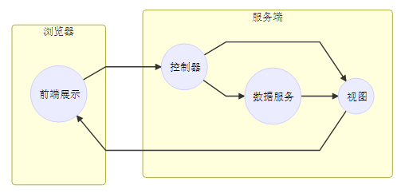
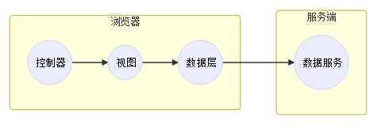

# 单页面应用的基本概念

## 什么是单页面应用（SPA）？
`单页面应用`是仅包含单个网页的应用，**目的**是为了提供类似于本地应用的流畅用户体验。

## 传统的网页应用

单个 `HTML` 页面作为功能元件，通过刷新，超链接、表单提交等方式，组合排列这些 HTML 页面，来为用户提供服务

- 在传统的网页应用中，浏览器更多的是充当一个展示层，路由处理、服务调用、页面跳转流程都**由服务端来处理**
   - 即 `MVC` 都放在**服务器端**，而 `V` 作为用户界面则通过网络发送到浏览器端，作为 `UI` 与用户交互

- 特点
  - 重服务端
  - 页面频繁刷新   

> **Notes**  
> 上面表达的是一种普遍的范式，而 Ajax 则是这个范式的异类。Ajax 的出现使得网页可以局部更新，使得网页上的一部分可以作为一个功能元件来为用户提供服务。这种形式的网页应用已经具备单页应用的雏型，但并不是标准的单页应用

## 单页应用的特点
相较于传统网页应用，`单页应用`将 `MVC` 前置到了**浏览器端**

- 控制器前置
  - 单页应用将**路由处理**放在浏览器
    > 在浏览器端直接响应浏览器地址的变化，分发到对应的路由，向用户呈现对应的界面
- 以小块组件为功能元件
    - 在路由变化时，不再刷新整个页面，而是组合这些小的组件，替换变化的部分
- 数据层前置
   - 单页应用在浏览器端通常有一层实实在在的数据层，而服务端则退化成了完全的数据 API。浏览器端的数据层会封装服务端 API，供上层的视图层调用

## 单页应用的好与坏
### 优点
- 无刷新体验
- 完全的前端组件化
- API 共享
- 组件共享
- 前后端职责分离，架构清晰：前端进行交互逻辑，后端负责数据处理。
- 前后端单独开发、单独测试。
- 良好的交互体验，前端进行的是局部渲染。避免了不必要的跳转和重复渲染
### 缺点
- 首次加载大量资源
   - 要加载大量的静态资源，这个加载时间相对比较长；
- 较高的前端开发门槛
- 不利于 SEO
   - 单页页面，数据在前端渲染，就意味着没有 `SEO`，或者需要使用变通的方案

> **总结**  
> - **单页应用**是对原来 `Ajax` 组件的一种延伸，相较于传统的网页应用，将 MVC 前置到了浏览器端，浏览器就相当于 `iOS` 系统，单页应用就像是应用，与服务端仅仅通过 `API` 来沟通

## 参考
- [开发无框架单页面应用](http://web.jobbole.com/81990/)
- [一种SPA（单页面应用）架构](https://segmentfault.com/a/1190000000607661#articleHeader0)
- [单页应用开发基础](http://island205.github.io/Single-Page-App-Break/%E7%AC%AC01%E7%AB%A0%20%E4%BD%95%E4%B8%BA%E5%8D%95%E9%A1%B5%E5%BA%94%E7%94%A8.html)

