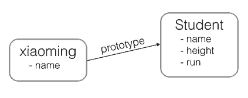

# JS面向对象编程

JavaScript**不区**`类`和`实例`的概念，而是通过`原型`（`prototype`）来实现面向对象编程


## JS原型链
JavaScript的`原型链`和Java的`Class`区别就在，它没有“`Class`”的概念，**所有对象都是实例**，所谓`继承关系`不过是**把一个对象的原型指向另一个对象**

```javascript
var Student = {
    name: 'Robot',
    height: 1.2,
    run: function () {
        console.log(this.name + ' is running...');
    }
};

var xiaoming = {
    name: '小明'
};

xiaoming.__proto__ = Student;
```


- 在编写JavaScript代码时，不要直接用`obj.__proto__`去改变一个对象的原型，并且，低版本的IE也无法使用`__proto__`

- `Object.create()`方法可以**传入一个原型对象**，**并创建一个基于该原型的新对象**


## 创建对象

- 每个创建的对象都会设置一个**原型**，指向它的`原型对象`
- JS属性查找
  1. `JavaScript引擎`先在当前对象上查找该属性，
  2. 如果没有找到，就到**其原型对象上找**，如果还没有找到，
  3. 就一直上溯到`Object.prototype`对象，
  4. 最后，如果还没有找到，就只能返回`undefined`


```javascript
//1. Array对象
var arr = [1, 2, 3];
//其原型链是：
arr ----> Array.prototype ----> Object.prototype ----> null

//2. 创建一个函数时
function foo() {
    return 0;
}
//其原型链
foo ----> Function.prototype ----> Object.prototype ----> null

//Function.prototype定义了apply()等方法，因此，所有函数都可以调用apply()方法

```  

## 构造函数
JavaScript还可以用一种`构造函数`的方法来**创建对象**

```javascript
function Student(name) {
    this.name = name;
    this.hello = function () {
        alert('Hello, ' + this.name + '!');
    }
}
```
- 是一个`普通函数`
- 可以用`关键字new`来**调用这个函数**，并*返回一个对象*
```javascript
var xiaoming = new Student('小明');
//原型链
xiaoming ----> Student.prototype ----> Object.prototype ----> null
```
> 如果不写`new`，这就是一个普通函数，它返回`undefined`。但是，如果写了`new`，它就变成了一个构造函数，它绑定的`this`**指向新创建的对象**，并默认返回`this`，也就是说，不需要在最后写`return this`;。

-  `constructor`属性


- 红色箭头是`原型链`

## 忘记写new
- 在`strict模式`下，`this.name = name`将报错，因为`this`绑定为`undefined`
- 在`非strict模式`下，`this.name = name`不报错，因为`this`绑定为`window`
- 调用构造函数**千万不要忘记写`new`**
- **按照约定**
   - `构造函数`**首字母应当大写**，
   - `普通函数`**首字母应当小写**

## 常用的编程模式
```javascript
function Student(props) {
    this.name = props.name || '匿名'; // 默认值为'匿名'
    this.grade = props.grade || 1; // 默认值为1
}

Student.prototype.hello = function () {
    alert('Hello, ' + this.name + '!');
};

function createStudent(props) {
    return new Student(props || {})
}
```
- `createStudent()`函数
- 不需要`new`来调用，二是参数非常灵活
   - 可以不传，也可以这么传
   
```javascript
var xiaoming = createStudent({
    name: '小明'
});

xiaoming.grade; // 1
```

## 原型继承
- `JavaScript`由于采用`原型继承`，我们无法直接扩展一个`Class`，因为根本不存在`Class`这种类型
- 须借助一个**中间对象**来实现正确的`原型链`，这个中间对象的原型要指向`Student.prototype`
   - **中间对象**可以用一个`空函数F`来实现
   - 函数`F`仅用于**桥接**，我们仅创建了一个`new F()`实例，而且，没有改变原有的`Student`定义的原型链

```javascript
// PrimaryStudent构造函数:
function PrimaryStudent(props) {
    Student.call(this, props);
    this.grade = props.grade || 1;
}

// 空函数F:
function F() {
}

// 把F的原型指向Student.prototype:
F.prototype = Student.prototype;

// 把PrimaryStudent的原型指向一个新的F对象，F对象的原型正好指向Student.prototype:
PrimaryStudent.prototype = new F();

// 把PrimaryStudent原型的构造函数修复为PrimaryStudent:
PrimaryStudent.prototype.constructor = PrimaryStudent;

// 继续在PrimaryStudent原型（就是new F()对象）上定义方法：
PrimaryStudent.prototype.getGrade = function () {
    return this.grade;
};

// 创建xiaoming:
var xiaoming = new PrimaryStudent({
    name: '小明',
    grade: 2
});
xiaoming.name; // '小明'
xiaoming.grade; // 2

// 验证原型:
xiaoming.__proto__ === PrimaryStudent.prototype; // true
xiaoming.__proto__.__proto__ === Student.prototype; // true

// 验证继承关系:
xiaoming instanceof PrimaryStudent; // true
xiaoming instanceof Student; // true
```   

- 把继承这个动作用一个`inherits()`函数封装起来，还可以隐藏F的定义，并简化代码

```javascript
function inherits(Child, Parent) {
    var F = function () {};
    F.prototype = Parent.prototype;
    Child.prototype = new F();
    Child.prototype.constructor = Child;
}
```

- `inherits()`函数可以复用

```javascript
function Student(props) {
    this.name = props.name || 'Unnamed';
}

Student.prototype.hello = function () {
    alert('Hello, ' + this.name + '!');
}

function PrimaryStudent(props) {
    Student.call(this, props);
    this.grade = props.grade || 1;
}

// 实现原型继承链:
inherits(PrimaryStudent, Student);

// 绑定其他方法到PrimaryStudent原型:
PrimaryStudent.prototype.getGrade = function () {
    return this.grade;
};
```

### 原型继承实现方式
1. 定义**新的构造函数**，并在内部用`call()`**调用希望继承的构造函数**，并**绑定`this`**；
2. 借助`中间函数F`实现`原型链继承`，最好通过封装的`inherits`函数完成；
3. 继续在`新的构造函数`的`原型`上定义**新方法**


### class继承
- `class`从**ES6**开始正式被引入到JavaScript中
   - `class`的目的就是让定义类更简单

```javascript
class Student {
    constructor(name) {
        this.name = name;
    }

    hello() {
        alert('Hello, ' + this.name + '!');
    }
}
```

- class继承

```javascript
class PrimaryStudent extends Student {
    constructor(name, grade) {
        super(name); // 记得用super调用父类的构造方法!
        this.grade = grade;
    }

    myGrade() {
        alert('I am at grade ' + this.grade);
    }
}
```
- 用`class`的好处就是极大地简化了**原型链代码**
- **不是**所有的主流浏览器都支持*`ES6`的`class`
